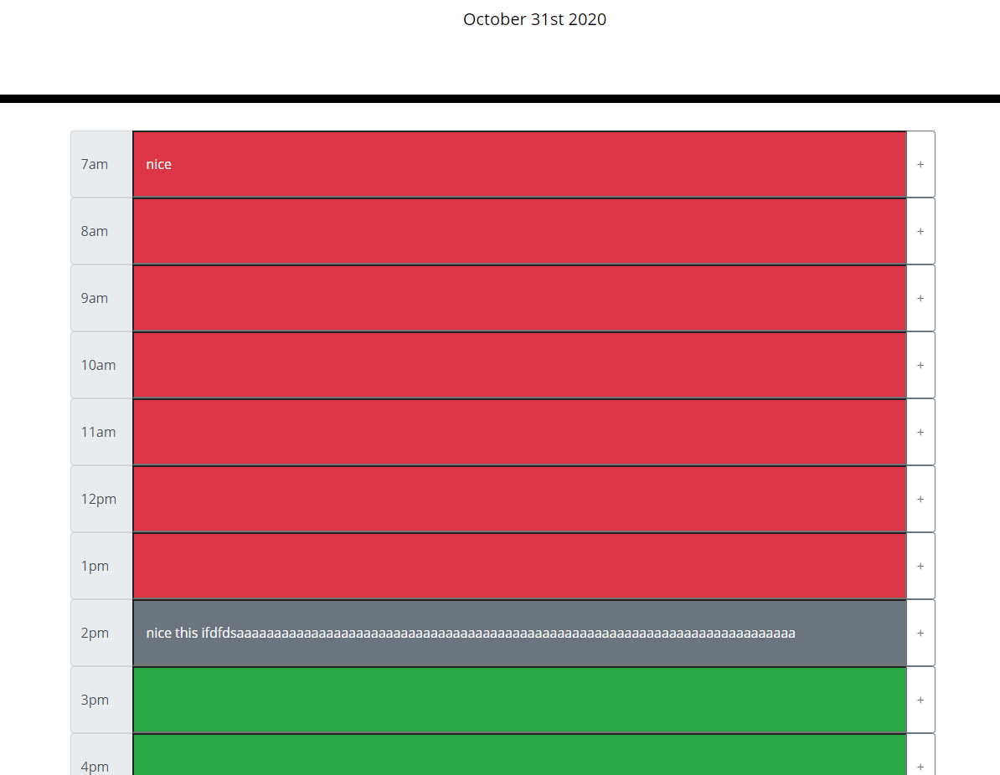

# README
## Work Day Planner
This work-day planner is designed to help busy users plan their days. Text entered each hour will persist on refresh
and past hours will be color coded dynamically using the moment.js library. The current hour and the remaining hours are also color coded.

## Example

## Live link
[Here](https://jtwob.github.io/Daily_Planner/)